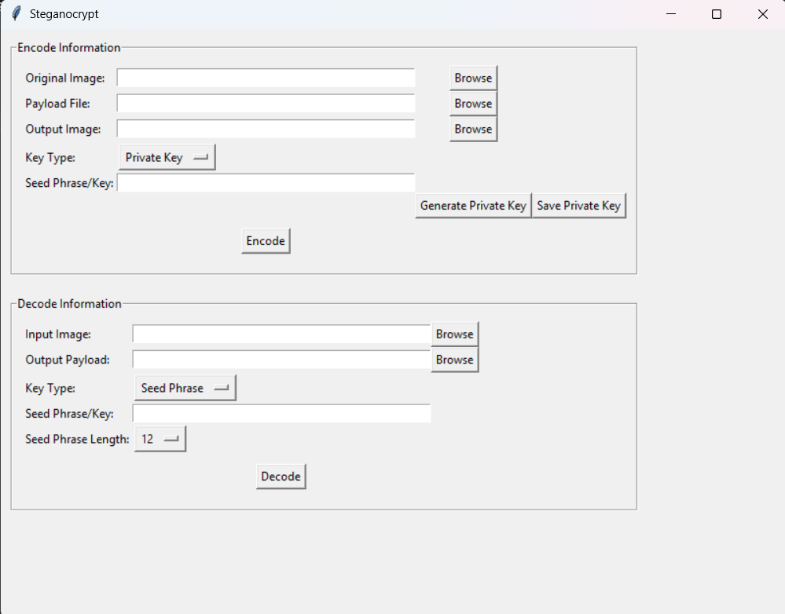

# Steganocrypt

Steganocrypt is a Python tool that combines steganography and cryptography to hide information within images. It allows users to encrypt a payload (text or any file) using AES-GCM and then embed the encrypted data into the least significant bits of a PNG image. The hidden information can then be extracted and decrypted using a seed phrase or private key.

## Features

- **Encryption**: Uses AES-GCM with a "STEGO" header and 128-bit authentication tag.
- **Key Derivation**: Derives encryption keys from BIP-39 seed phrases or private keys using PBKDF2 (SHA-256, 200,000 iterations).
- **Steganography**: Embeds encrypted data (ciphertext, salt, nonce, tag) into the least significant bits (LSB) of PNG pixel data.
- **CLI**: Command-line interface for easy encoding and decoding.
- **Integrity Check**: Validates decryption by checking the "STEGO" header and authentication tag.

## Installation

1. **Clone the repository (or download the files):**

   ```bash
   git clone https://github.com/your_username/steganocrypt.git
   cd steganocrypt
   ```

2. **Create a virtual environment (recommended):**

   ```bash
   python -m venv venv
   .\venv\Scripts\activate  # On Windows
   source venv/bin/activate  # On macOS/Linux
   ```

3. **Install dependencies:**

   ```bash
   pip install -r requirements.txt
   ```

## Usage

### Encoding

To encode a payload into a cover image:

```bash
python main.py encode --input cover.png --output stego.png --payload secret.txt --seed "your seed phrase or private key"
```

- `--input` or `-i`: Path to the cover PNG image.
- `--output` or `-o`: Path to save the stego PNG image.
- `--payload` or `-p`: Path to the payload file (e.g., `secret.txt`).
- `--seed` or `-s`: The BIP-39 seed phrase or private key used for encryption.

### Decoding

To decode a hidden payload from a stego image:

```bash
python main.py decode --input stego.png --seed "your seed phrase or private key" --output decoded_secret.txt
```

- `--input` or `-i`: Path to the stego PNG image.
- `--seed` or `-s`: The BIP-39 seed phrase or private key used for decryption.
- `--output` or `-o`: (Optional) Path to save the decoded payload. If not provided, it defaults to `decoded_payload.bin`.

## Project Structure

- `main.py`: The main script for the command-line interface.
- `crypto_utils.py`: Contains functions for key derivation, AES-GCM encryption, and decryption.
- `stego_utils.py`: Contains functions for LSB embedding and extraction of data in PNG images.
- `requirements.txt`: Lists the Python dependencies (Pillow, PyCryptodome).

## Security Considerations

- **Seed Phrase/Private Key Security**: The security of your hidden information heavily relies on the secrecy of your seed phrase or private key. Keep it secure and do not share it.
- **Image Capacity**: Embedding large amounts of data can lead to noticeable distortions in the image. This tool uses 1 LSB per color channel, which offers a good balance between capacity and visual imperceptibility.

## Future Enhancements

- **Desktop Application**: Develop a user-friendly desktop application with a graphical interface.
- **Seed Phrase Generation**: Implement functionality to generate BIP-39 seed phrases within the application.
- **Variable LSB Bits**: Allow users to choose the number of LSBs to use for embedding, offering a trade-off between capacity and imperceptibility.
## Future Enhancements

- **Desktop Application**: Develop a user-friendly desktop application with a graphical interface.
- **Seed Phrase Generation**: Implement functionality to generate BIP-39 seed phrases within the application.
- **Variable LSB Bits**: Allow users to choose the number of LSBs to use for embedding, offering a trade-off between capacity and imperceptibility.
- **Image Size Preservation**: Investigate techniques to maintain similar file sizes between original and stego images to avoid suspicion.

## Screenshots

### 1. Steganocrypt GUI


### 2. Steganocrypt Encoding


### 3. Private Key Generation


### 4. Private Key Saving


### 5. Encoding


### 6. Encoding Successful


### 7. Private Key Look


### 8. Steganocrypt Decoding


### 9. Steganocrypt Decoding 2


### 11. Private Key Verification For Decoding


### 12. Decode Successful


### 13. Output Payload File (Decoding Result)
.png)

### 14. Output Payload Result (Decoding Result)
.png)

### 15. Files
